# ZEUS — Autonomous Payload-Delivery Hexacopter


> **Note —** This is an **aero design project**, not a software repository. There is no source code: the work covers conceptual design, weight & thrust budgeting, propulsion sizing, structural analysis, CAD, and the build itself. This repo holds the SolidWorks assets, the system architecture, and the engineering drawing produced for the design report.

A custom-built hexacopter for autonomous waypoint missions with a 900 g servo-actuated payload drop. Designed and built by **Team ASRL** at SRM Institute of Science and Technology for **Rotorcraft Design Challenge — Nitte 2024**, the annual collegiate aero-design competition organised by **NMAM Institute of Technology** under the **SAE India Aerospace** banner (Team No. ROTOR2407).

## Contents

- [Conceptual Design](#conceptual-design)
- [Weight Estimation](#weight-estimation)
- [Thrust Estimation](#thrust-estimation)
- [Propulsion System](#propulsion-system)
- [UAV Configuration Selection](#uav-configuration-selection)
- [Wheelbase & Sizing](#wheelbase--sizing)
- [Power & Endurance](#power--endurance)
- [Design Iterations](#design-iterations)
- [Material Selection](#material-selection)
- [Subsystem Selection](#subsystem-selection)
- [System Architecture](#system-architecture)
- [CG, Topology Optimisation & FEA](#cg-topology-optimisation--fea)
- [Landing Gear](#landing-gear)
- [Autonomous Mission](#autonomous-mission)
- [Payload Drop Mechanism](#payload-drop-mechanism)
- [Weight Breakdown](#weight-breakdown)
- [Bill of Materials](#bill-of-materials)
- [Engineering Drawing](#engineering-drawing)

## Conceptual Design

<p align="center">
  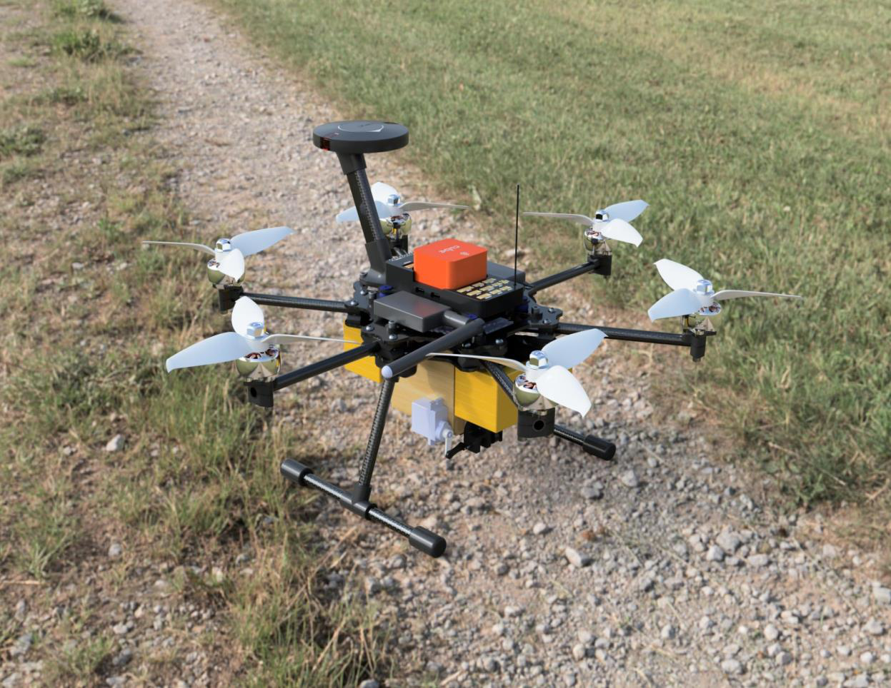
  <br/><em>Fig. 1 — High level view of the assembled ZEUS platform</em>
</p>

ZEUS is a 2 kg-class hexacopter engineered for autonomous flight with precision payload delivery. The platform integrates a topology-optimised carbon-fiber airframe, a Pixhawk-based avionics stack, and a torque-balanced double-door payload bay. The full mission — take-off, GPS waypoint navigation, target loiter, payload release, return-to-home — is planned in Mission Planner and executed autonomously by the flight controller.

The hexacopter configuration was chosen over a quadcopter for the 50% thrust margin and motor-failure tolerance, and over an octocopter to keep weight and current draw low enough to fit a 5+ minute flight envelope on a single 6S battery pack.

## Weight Estimation

Take-off weight is estimated using the standard rotorcraft formula:

```
Wto = Woe + Wpl + Wf
```

| Term | Description | Value |
|---|---|---|
| `Woe` | Operational empty weight (frame + electronics, no battery) | 671 g |
| `Wpl` | Payload weight (mission requirement) | 900 g |
| `Wf`  | "Fuel" weight — battery pack | 480 g |
| **`Wto`** | **Total take-off weight** | **2051 g** |

Preliminary estimate during early design was 2120 g; the final figure of **2051 g** reflects a 69 g reduction achieved through frame iteration and topology optimisation.

## Thrust Estimation

```
Thrust required for take-off = Wto + 20% safety margin
                             = 2051 + 410.2 = 2461.2 g

Thrust per motor             = 2461.2 / 6 = 410.2 g
```

A 20% margin above hover ensures sufficient authority for climb, manoeuvring, and gust rejection. The selected motor/prop combination delivers >430 g per motor at the operating voltage, clearing the requirement.

## Propulsion System

An electric propulsion system was chosen for low noise, zero local emissions, and compatibility with the small-frame BLDC ecosystem.

| Item | Selection | Rationale |
|---|---|---|
| Motors | **Emax ECO II 2306, 1700 KV BLDC** | Meets 410 g/motor static thrust target; high durability; low electrical noise |
| Propellers | **5″ tri-blade** | Best stability/efficiency trade for the wheelbase; tri-blade preferred over bi-blade for thrust at this disc loading |
| Battery | **2× 1300 mAh 6S LiPo (parallel)** | 2600 mAh, 25.2 V nominal, 100C discharge — supports peak current and 5 min endurance |

<table align="center">
<tr>
<td align="center">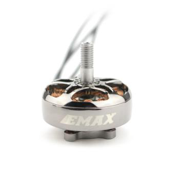<br/><em>Fig. 2 — Emax ECO II 2306 BLDC motor</em></td>
<td align="center">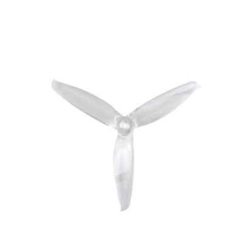<br/><em>Fig. 3 — 5″ tri-blade propeller</em></td>
</tr>
</table>

## UAV Configuration Selection

| Configuration | Weight | Endurance | Stability | Thrust |
|---|---|---|---|---|
| Quadcopter | Low | High | Low | Low |
| **Hexacopter** | **Medium** | **Medium** | **High** | **High** |
| Octocopter | High | Low | High | High |

**Why hexacopter:** Two extra motors over a quadcopter increase total static thrust by 50%, reduce per-motor load and current draw, and provide tolerance to a single-motor failure (the controller can compensate by re-mixing the remaining five). An octocopter would add weight and current draw without a meaningful payload-fraction gain at this scale.

<table align="center">
<tr>
<td align="center">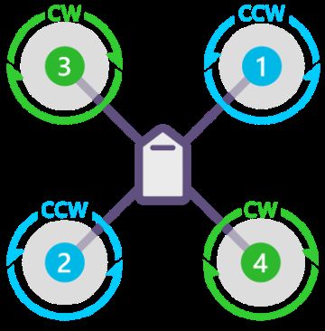<br/><em>Fig. 4 — X Quad</em></td>
<td align="center">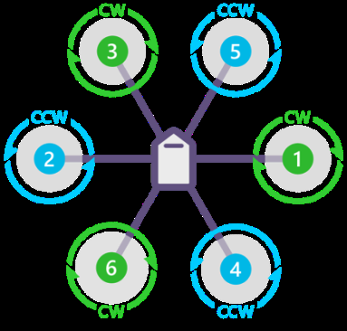<br/><em>Fig. 5 — X Hexa (selected)</em></td>
<td align="center">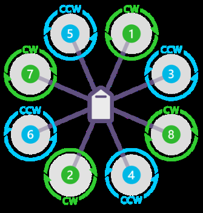<br/><em>Fig. 6 — X Octo</em></td>
</tr>
</table>

## Wheelbase & Sizing

- **Horizontal wheelbase** (centre to centre, adjacent motor mount): **168 mm**
- **Diagonal wheelbase** (motor to opposite motor): **335 mm**
- **Propeller clearance**: **40 mm** between adjacent prop tips to prevent collisions
- **Overall envelope**: L = 335.5 mm, W = 290.5 mm, H = 237.6 mm
- **Landing gear height**: 100 mm — sufficient ground clearance for payload bay attachment without ground strike

All electronics live on the top plate for CG balance and easy field access. The two batteries sit symmetrically front and rear at datum distances of 89 mm and 199 mm so the loaded CG stays within ±5 mm of the geometric centre.

<table align="center">
<tr>
<td align="center">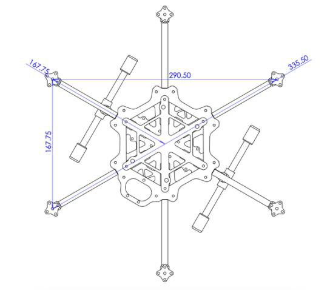<br/><em>Fig. 7 — Wheelbase &amp; top view dimensions</em></td>
<td align="center">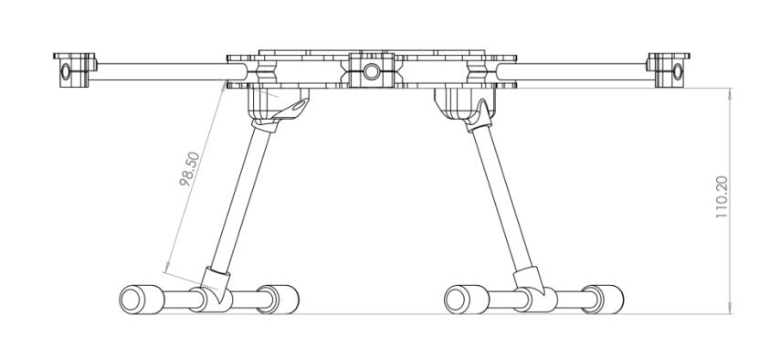<br/><em>Fig. 8 — Front view with landing-gear clearance</em></td>
</tr>
</table>

## Power & Endurance

**Power required (hover):**

```
Hover current per motor : 4 A
Bus voltage             : 25.2 V
Power per motor         : 100.8 W
Power for 6 motors      : 604.8 W
Avionics overhead       : ~20 W
Total hover power       : 625 W
```

**Power available:**

```
Battery energy = 2.6 Ah × 25.2 V = 65.52 Wh
Energy for 5 min hover = 625 W × (5/60) h = 51.875 Wh   ✓ (margin of 13.6 Wh)
```

**Endurance:**

```
Avg amp draw = (Wto · 294.811 W/kg) / 25.2 V
             = (2.051 · 294.811) / 25.2
             = 23.99 A

Flight time @ 80% safe discharge = (2.6 · 0.8) / 23.99
                                 = 0.0867 h
                                 ≈ 5.20 min
```

The 80% discharge limit is enforced to preserve LiPo cell health.

## Design Iterations

The frame went through three major iterations, each driven by FEA results and weight measurements from the previous build.

**Iteration 1 — Strength-first.**
Designed to withstand extreme combined loads. Base plate topology-optimised with 10% material removal. 15 mm CF round tubes used as arms. Motor mount plates fixed with two dual-arm attachments per arm for maximum stiffness. **Drawback:** excessive weight from the heavy tubes and large fastener count.

**Iteration 2 — Weight reduction.**
Aggressive topology optimisation on every plate. 15 mm CF round tubes replaced with **pultruded CF square tubes** (lighter, easier to clamp). Motor mount bolts cut from **9 to 2 per motor**. Significant weight savings, but the square pultruded tubes were not as strong as desired in bending.

**Final Iteration — Stability + strength.**
Distance between base and top plate **minimised** to maximise frame torsional stiffness. Pultruded square tubes replaced with **8 mm circular 3K roll-wrapped CF tubes** — lighter per arm and significantly stronger than pultruded due to the continuous fibre wrap. This is the version that flew.

<table align="center">
<tr>
<td align="center">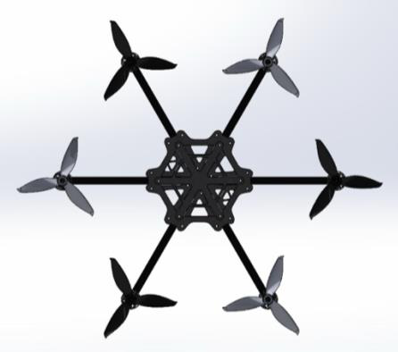<br/><em>Fig. 9 — Iteration 1 (strength-first)</em></td>
<td align="center">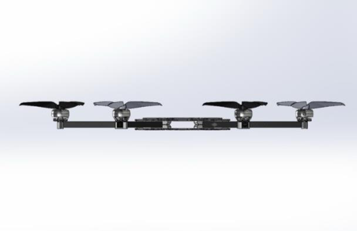<br/><em>Fig. 10 — Iteration 2 (weight reduction)</em></td>
<td align="center">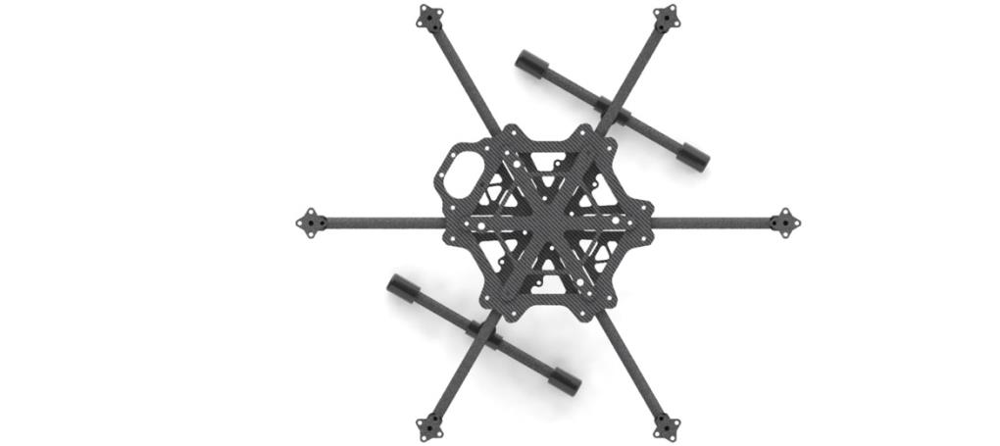<br/><em>Fig. 11 — Final iteration</em></td>
</tr>
</table>

## Material Selection

**Carbon-Fiber Plate (frame plates).** High strength-to-weight ratio carries flight loads with minimal mass. Rigid under combined thrust and gust loads, preventing flex that would otherwise corrupt IMU readings.

**3K Roll-Wrapped CF Tube (arms).** Continuous-fibre wrapped tubes selected over pultruded because the fibre orientation gives excellent bending and torsional stiffness — essential for arms that carry the full thrust moment of one motor at the tip.

**PLA+ (3D-printed attachments).** All complex geometric attachments — motor mounts, arm clamps, payload bay parts, landing gear feet — manufactured via FDM 3D printing in PLA+. Higher toughness and inter-layer adhesion than standard PLA, no warping issues during long prints.

<p align="center">
  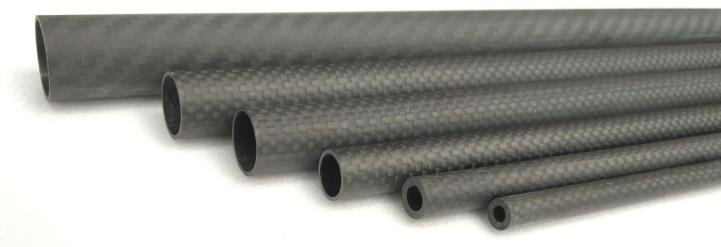
  <br/><em>Fig. 12 — 3K roll-wrapped carbon-fiber tube stock used for the arms</em>
</p>

## Subsystem Selection

### Telemetry
**Holybro SiK Telemetry Module.** MAVLink-compatible, plug-and-play with Mission Planner. 433 MHz, 500 mW output. Used for live mission upload, parameter tuning in the field, and downlink of GPS / battery / attitude.

<p align="center">
  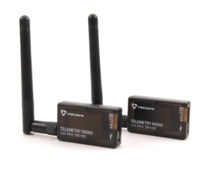
  <br/><em>Fig. 13 — Holybro telemetry SiK module pair</em>
</p>

### Radio link
**TBS Tango 2 Pro + Crossfire receiver.** Crossfire protocol on 915 MHz, 4 km range, 8 channels — 4 for axes (roll, pitch, yaw, throttle) and 4 for flight mode switching, payload trigger, and arm/disarm.

<p align="center">
  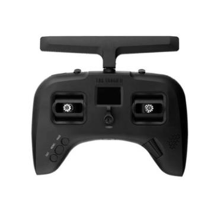
  <br/><em>Fig. 14 — TBS Tango 2 Pro transmitter</em>
</p>

### Flight controller
**Pixhawk Cube Orange.**
- 3 sets of IMU sensors with redundancy voting
- 2 of the 3 IMUs are vibration-isolated for accurate state estimation
- Onboard heater resistors hold IMU temperature stable to reduce gyro bias drift
- Runs ArduPilot with the standard hexacopter mixer

<p align="center">
  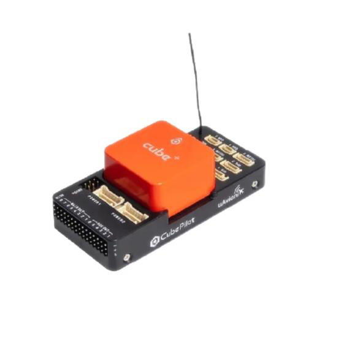
  <br/><em>Fig. 15 — Pixhawk Cube Orange flight controller</em>
</p>

### GPS / INS
**Here3 GPS.** Full inertial navigation suite — gyroscope, accelerometer, magnetometer, barometer — combined with GNSS receiver. RTK positioning data is fused with IMU/baro in the Pixhawk's Extended Kalman Filter (EKF) for sub-metre position hold.

<p align="center">
  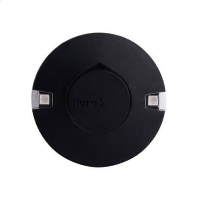
  <br/><em>Fig. 16 — Here3 RTK GPS / INS unit</em>
</p>

### Electronic Speed Controllers
Two **4-in-1 ESC modules** chosen instead of six individual ESCs to save weight, wiring complexity, and assembly time. Specifications:
- 3S–6S input range
- 50 A continuous per channel
- 1000 µF bulk capacitor per ESC to filter PWM-induced current ripple at the battery bus

<table align="center">
<tr>
<td align="center">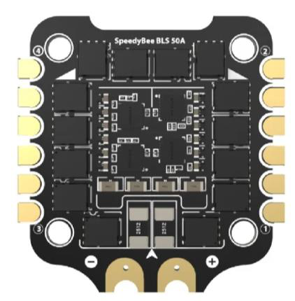<br/><em>Fig. 17 — Speedybee 50 A 4-in-1 ESC</em></td>
<td align="center">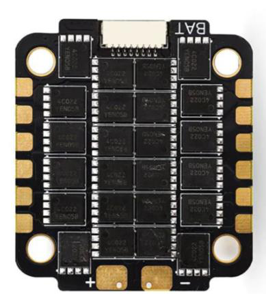<br/><em>Fig. 18 — HGLRC 50 A 4-in-1 ESC</em></td>
</tr>
</table>

## System Architecture

<p align="center">
  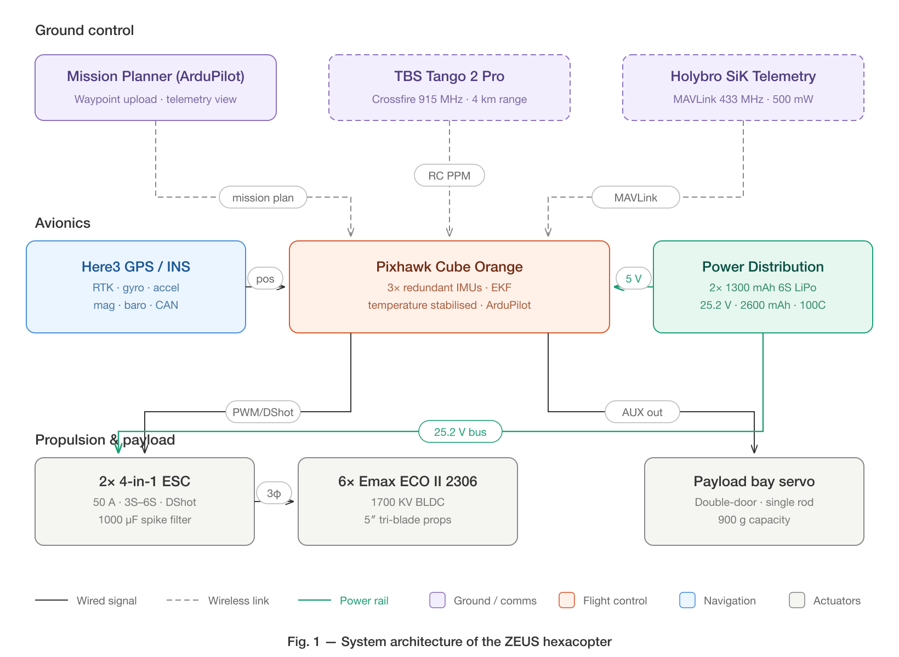
</p>

## CG, Topology Optimisation & FEA

**CG estimation.** Two battery slots are placed symmetrically front and back of the frame. The loaded CG falls almost exactly at the midpoint of the two battery slots and slightly above the geometric origin of the airframe — close enough to the thrust centroid that no asymmetric trim is required.

<p align="center">
  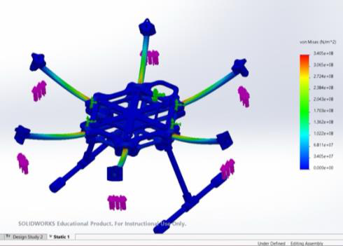
  <br/><em>Fig. 20 — Loaded CG: ZEUS with payload bay attached, front view</em>
</p>

**Topology optimisation.** Two FEA load cases were run on the base plate:
- *Method 1* — fixtures at the arm mountings, force applied at the plate centre (simulating a payload load on a hovering frame)
- *Method 2* — centre of plate fixed, force applied at the arm mountings (simulating thrust loads in flight)

The final geometry is the **intersection** of the load paths from both methods — material is removed only where neither case carries stress.

<table align="center">
<tr>
<td align="center">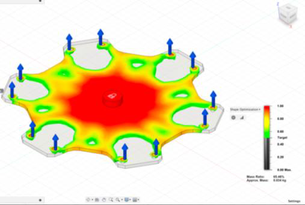<br/><em>Fig. 21 — Topology optimisation, Method 1</em></td>
<td align="center">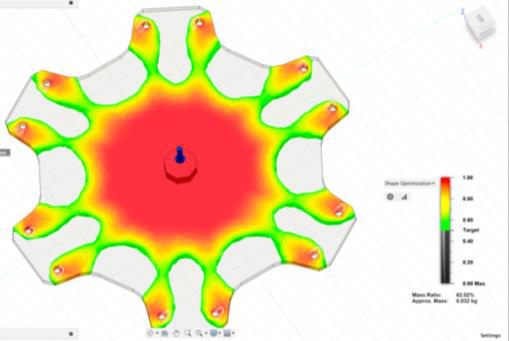<br/><em>Fig. 22 — Topology optimisation, Method 2</em></td>
</tr>
</table>

**Static structural analysis.** Whole-frame FEA was run under the maximum combined static thrust of all six motors (~120 N) to validate plate integrity under the worst-case flight load. Maximum von Mises stress stayed well below the CF laminate's yield, with peak displacement at the plate corners.

<table align="center">
<tr>
<td align="center">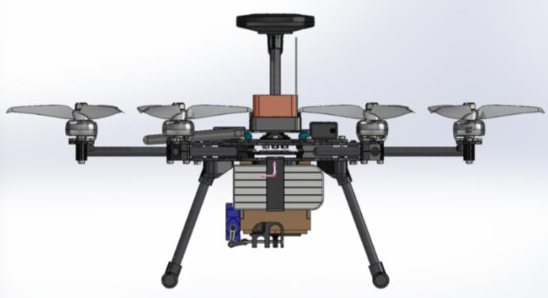<br/><em>Fig. 23 — Plate-level static FEA</em></td>
<td align="center">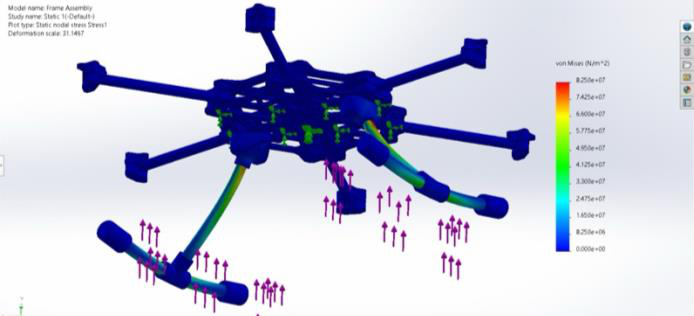<br/><em>Fig. 24 — Full-frame static FEA under 120 N thrust</em></td>
</tr>
</table>

## Landing Gear

A **skid-type** landing gear was selected over wheeled or fixed-leg alternatives for maximum stability and ground contact area. The gear was designed in SolidWorks and run through FEA under the worst-case landing impact load to size the wall thickness. Complex skid geometry is **3D-printed in PLA+** with internal infill tuned to absorb impact energy without permanent deformation.

The 100 mm clearance is the minimum that lets the payload bay clear the ground when the bay doors are open.

<p align="center">
  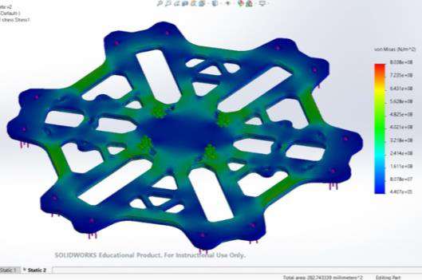
  <br/><em>Fig. 25 — Landing gear FEA under landing impact load</em>
</p>

## Autonomous Mission

Mission planning is done in **Mission Planner (ArduPilot)**. The pilot defines the home position, take-off altitude, GPS waypoint sequence, and return-to-home behaviour; the full plan is uploaded to the Pixhawk over the 433 MHz MAVLink telemetry link before flight.

```
Arm + Take-off  →  Waypoint nav  →  Target loiter  →  Payload drop  →  Return to home
```

**Phase 1 — Take-off.** Take-off altitude is set to 5 m in the ground station. The Pixhawk arms, spools the motors, and climbs vertically to the set altitude under altitude-hold.

**Phase 2 — Waypoint Navigation.** The drone follows the planned GPS waypoint path autonomously between home and the target area. The EKF fuses RTK GPS with IMU and baro to maintain position lock.

**Phase 3 — Target Loiter & Drop.** The drone holds station above the target while the payload servo is triggered (via an AUX channel from the FC).

**Phase 4 — Return to Home.** On mission completion, the drone autonomously returns to the home position and performs a controlled descent.

<table align="center">
<tr>
<td align="center">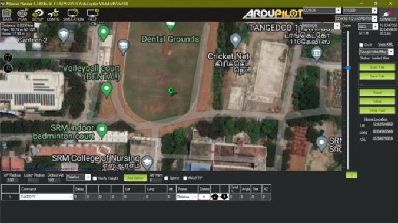<br/><em>Fig. 26 — Mission Planner: take-off altitude set</em></td>
<td align="center">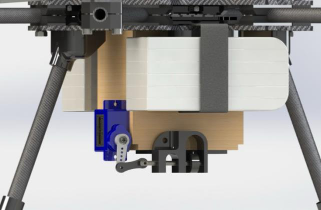<br/><em>Fig. 27 — Mission Planner: waypoint plan</em></td>
</tr>
</table>

## Payload Drop Mechanism

The payload bay sits below the frame on a **double-door release mechanism** actuated by a single servo. Key design choices:

- **Double-door geometry** — two symmetric doors open simultaneously instead of a single side door. This cancels the reaction torque at release so the drop does not perturb the airframe's attitude.
- **Single-rod lock** — a single sliding rod, driven by one servo, latches both doors. This minimises the part count and the failure modes.
- **900 g rated capacity** — sized to the competition payload spec.
- **Mounted below the airframe** on the centreline so the CG shift after release is purely vertical.

<table align="center">
<tr>
<td align="center">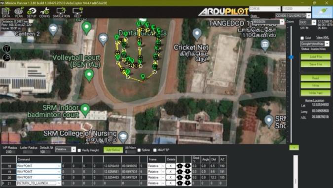<br/><em>Fig. 28 — Payload bay (doors closed, latched)</em></td>
<td align="center">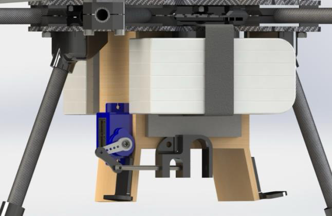<br/><em>Fig. 29 — Payload bay (servo + lock rod detail)</em></td>
</tr>
</table>

## Weight Breakdown

### Electronics

| Component | Unit (g) | Qty | Total (g) |
|---|---|---|---|
| BLDC motors | 30.4 | 6 | 182.4 |
| Battery (6S 1300 mAh) | 230 | 2 | 460 |
| 4-in-1 ESC | 18 | 2 | 36 |
| Here3 GPS | 48.8 | 1 | 48.8 |
| Pixhawk Cube Orange | 73 | 1 | 73 |
| Holybro Telemetry | 15 | 1 | 15 |
| Crossfire receiver | 2 | 1 | 2 |
| Power module | 14 | 1 | 14 |
| Propellers | 6.8 | 6 | 40.8 |
| Servo motor (payload) | 9 | 1 | 9 |
| **Subtotal** | | | **881 g** |

### Frame

| Component | Unit (g) | Qty | Total (g) |
|---|---|---|---|
| Base plate | 46.23 | 1 | 46.23 |
| Top plate | 28.48 | 1 | 28.48 |
| FC plate | 19.81 | 1 | 19.81 |
| Arm tube | 4.83 | 6 | 28.98 |
| Motor mount plate | 1.08 | 6 | 6.48 |
| LG vertical | 4.39 | 2 | 8.78 |
| LG horizontal | 6.59 | 2 | 13.18 |
| M3 × 20 mm bolt | 1.60 | 24 | 38.4 |
| M3 × 8 mm bolt | 1.10 | 6 | 6.6 |
| LG-to-base mount | 6.5 | 2 | 13 |
| LG damper | 1 | 4 | 4 |
| Arm mount | 1.5 | 12 | 18 |
| MM attachment | 1 | 12 | 12 |
| T attachment | 2 | 2 | 4 |
| **Subtotal** | | | **247.94 g** |

## Bill of Materials

| Component | Unit (₹) | Qty | Total (₹) |
|---|---|---|---|
| BLDC motor | 1,465 | 6 | 8,790 |
| 6S 1300 mAh LiPo | 2,499 | 2 | 4,998 |
| 4-in-1 ESC | 4,049 | 2 | 8,098 |
| Here3 GPS | 18,093 | 1 | 18,093 |
| Pixhawk Cube Orange | 32,999 | 1 | 32,999 |
| Holybro Telemetry | 7,563 | 1 | 7,563 |
| TBS Tango 2 + Crossfire Rx | 26,378 | 1 | 26,378 |
| Propellers | 179 | 2 | 358 |
| Servo motor | 97 | 1 | 97 |
| CF plate (2.5 mm) | 4,308 | 1 | 4,308 |
| CF tube (8 mm) | 649 | 3 | 1,947 |
| PLA+ filament | 999 | 1 | 999 |
| **Total** | | | **₹1,14,628** |

## Engineering Drawing

Final dimensioned drawing from the design report — front, right, top, and isometric views with weight & balance summary.

<p align="center">
  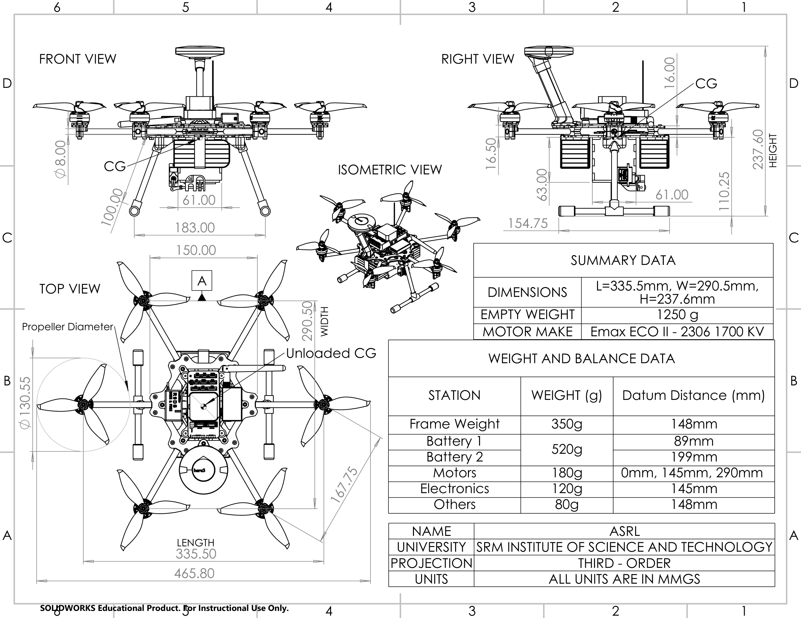
</p>

| Parameter | Value |
|---|---|
| Length × Width × Height | 335.5 × 290.5 × 237.6 mm |
| Empty weight | 1250 g |
| Motor | Emax ECO II 2306, 1700 KV |
| Propeller diameter | 130.55 mm (5″) |
| Landing gear clearance | 100 mm |

**Weight & balance stations** (datum at frame nose):

| Station | Weight (g) | Datum distance (mm) |
|---|---|---|
| Frame | 350 | 148 |
| Battery 1 | 520 | 89 |
| Battery 2 | 520 | 199 |
| Motors | 180 | 0 / 145 / 290 |
| Electronics | 120 | 145 |
| Other | 80 | 148 |

## Repository Layout

```
zeus/
├── cad/                     # SolidWorks parts, assemblies, and rendering setups
├── assets/figures/          # Figures from the design report
├── architecture.svg         # System architecture diagram (vector)
├── architecture.png         # Rendered architecture diagram
├── engineering_drawing.png  # Final dimensioned drawing (4-view + W&B)
└── README.md
```

## Stack

`ArduPilot` · `Mission Planner` · `Pixhawk Cube Orange` · `Here3 RTK GPS` · `MAVLink` · `Crossfire` · `SolidWorks` · `FEA` · `Topology Optimisation` · `Carbon Fiber` · `PLA+`

## Team

**Team ASRL — SRM Institute of Science and Technology**
P. Tarun Kumar · Raghunath VM · Adarsh Jha · Manan Wadhwa · Rhythm Pareek · Muhammed Sahal M N · Vijay Solanki · Akshika Pathania

## License

This project is licensed under the [MIT License](LICENSE).
